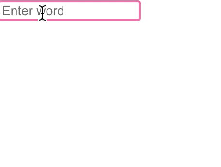

# Fictive Reality Mini Frontend Challenge

This is a mini challenge to test your skills in React & Javascript coding. It's created to be small and quick, it should not need more than 50-100 lines of code and should not take more than an hour to complete.

## Your mission

In the file `App.js` you should create an input field that the user types text into, and when you press **Enter**, the word should be added to a list below the input and the input cleared. Also, as you type, you should highlight the current input value if it can be found in any of the words in the list. See the GIF below for the expected behaviour.

Best way to submit is to zip your code and send it to us by email. You can also fork this repository to your GitHub profile and send us the link (but be aware that other people may be able to read your forked code).

## What we look for

- Using modern React (hooks)
- Clean and efficient code. Don't make it too complicated.
- Comments where needed

## If you want to spend some more time

*You don't need to!*

- Add a button to clear the list of words
- Think about error handling or unexpected input
- Use CSS to make the App look nicer
